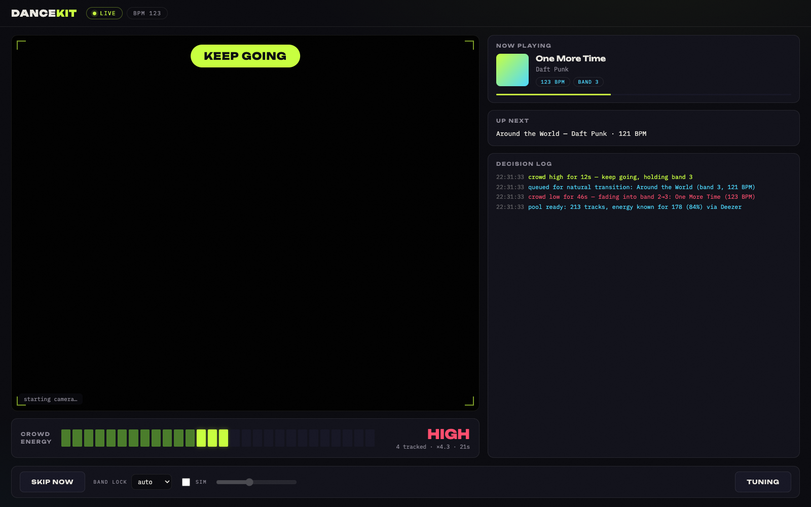
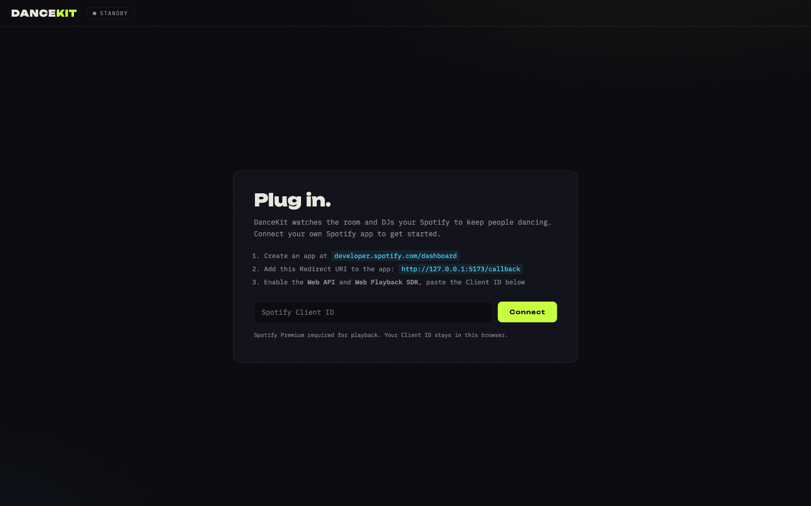

# DanceKit

A crowd-reactive auto DJ. A webcam watches the room, MoveNet pose detection scores how much
people are actually moving, and a DJ brain steers your Spotify playback to match: when the
floor goes quiet it switches up the tempo and energy; when people are dancing it keeps the lane.

Everything runs in your browser. No backend, no accounts — you bring your own Spotify app
credentials and a Premium account.





## Requirements

- **Spotify Premium** (the Web Playback SDK refuses free accounts)
- Node.js 18+
- A laptop/webcam pointed at the room
- Chrome or Edge recommended (Web Playback SDK needs DRM/EME support)

## Setup

1. **Create a Spotify app** at [developer.spotify.com/dashboard](https://developer.spotify.com/dashboard):
   - Redirect URI: `http://127.0.0.1:5173/callback` (Spotify no longer accepts `localhost`)
   - APIs used: **Web API** and **Web Playback SDK**
   - In *User Management*, add the email of every Spotify account that will log in
     (development-mode apps only allow allowlisted users, up to 25)
2. **Run it:**
   ```sh
   npm install
   npm run dev
   ```
3. Open `http://127.0.0.1:5173`, paste your app's **Client ID**, log in, pick the playlists
   for the night, and hit **Analyze & start**.

## How it works

- **Vision** (`src/vision/`): MoveNet multi-pose detection tracks up to 6 people, scores each
  person's movement against their own auto-calibrated baseline, and classifies the group as
  still / low / medium / high energy.
- **Metadata** (`src/metadata/`): Spotify removed the audio-features API (BPM, energy) for apps
  created after Nov 2024. DanceKit probes your key at startup — if it's a grandfathered app,
  real Spotify features are used; otherwise BPM comes from Deezer's public API (matched by ISRC)
  and energy is estimated from tempo + loudness. Results are cached in IndexedDB.
- **DJ brain** (`src/dj/`): the pool is split into energy bands. A sustained quiet floor triggers
  a switch to a higher band; a dancing floor keeps the lane, with the next track pre-queued near
  the end of the current one for a natural transition. Guardrails: minimum play time, decision
  cooldown, no repeats, limited BPM jumps. Every decision is explained in the dashboard log.
- **Simulation mode**: flip **SIM** in the console strip and drive the crowd-energy slider by
  hand to test the DJ brain without a party (or a camera).
- **Demo mode**: open `http://127.0.0.1:5173/?demo` to see the dashboard with sample data —
  no Spotify login needed. Handy for UI work and screenshots.

## Tuning

The **TUNING** drawer exposes the timing knobs (how long the floor must be quiet before a
switch, minimum play time, etc.). Settings persist in the browser.

## Known limitations

- Spotify streams can't be crossfaded or beatmatched (DRM) — transitions are well-timed track
  changes, not blended audio. Enabling Spotify's own crossfade setting (Settings → Playback)
  smooths them out.
- BPM coverage depends on Deezer knowing the track; obscure tracks may have no data and are
  excluded from tempo-targeted picks. The dashboard log reports coverage after analysis.
- Pose detection wants reasonable light. Party-dark rooms will read as "still" — point a lamp
  at the dance floor or use SIM mode.
